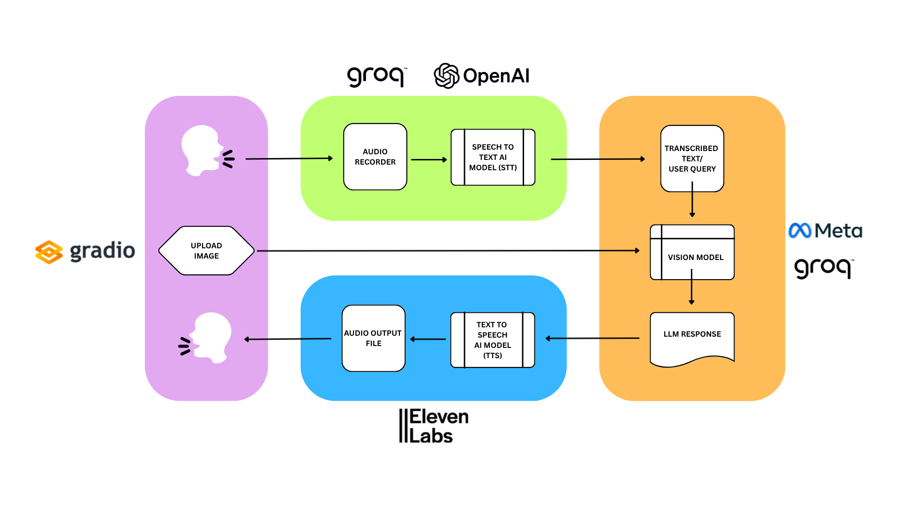
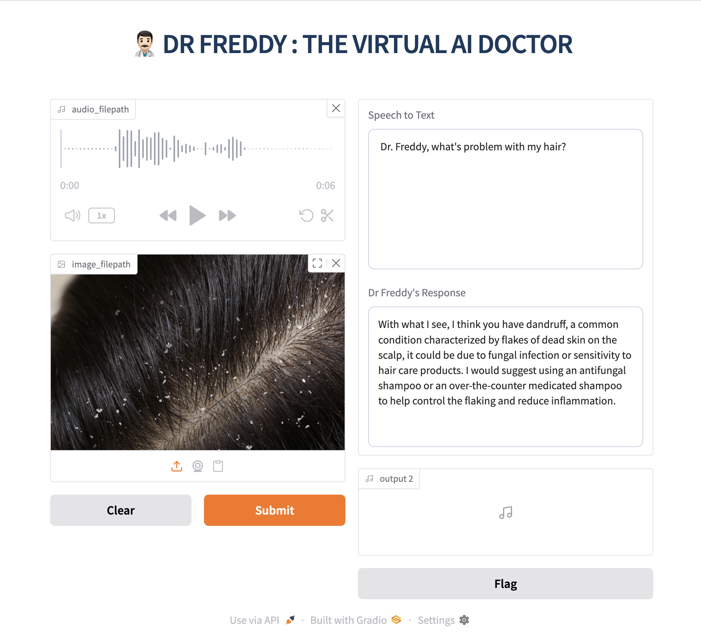

# Dr. Freddy: The Virtual AI Doctor 🩺🤖


An AI-powered, multimodal conversational agent designed for preliminary medical interactions. Dr. Freddy understands health concerns through voice and images and responds with both text and a natural-sounding voice.

### **[➡️ View the Full Project Report (PDF)](./Report/Atharv_Project_Report_Dr_Freddy.pdf)**

---

## 🌟 Key Features

* **🗣️ Voice Interaction:** Speak your medical queries directly to the application.
* **🖼️ Image Analysis:** Upload images (e.g., rashes, injuries) for visual context.
* **🧠 AI-Powered Reasoning:** Utilizes a powerful Large Language Model (Meta-Llama) to analyze inputs and generate medically-oriented responses.
* **🔊 Voice Output:** Receive responses in a natural, empathetic voice, creating a human-like interaction.
* **💻 Intuitive UI:** A simple and clean user interface built with Gradio for easy interaction.

## 🛠️ Technology Stack

| Component             | Technology / Service                                       |
| --------------------- | ---------------------------------------------------------- |
| **Backend Language** | Python 3.12                                                |
| **User Interface** | Gradio                                                     |
| **AI Inference Engine** | Groq                                                       |
| **Core LLM** | `meta-llama/llama-4-scout-17b-16e-instruct`                  |
| **Speech-to-Text** | OpenAI Whisper (via Groq)                                  |
| **Text-to-Speech** | ElevenLabs                                                 |
| **Package Management** | Pipenv                                                     |

## ⚙️ System Architecture

The application follows a sequential pipeline, processing user input through various AI services to generate a multimodal response.



## 🚀 Getting Started

Follow these instructions to set up and run the project on your local machine.

### Prerequisites

* Python 3.12 or later
* `pipenv` for package management (`pip install pipenv`)
* Git

### Installation & Setup

1.  **Clone the repository:**
    ```bash
    git clone https://github.com/Atharvofficial/Dr-Freddy-AI.git
    ```

2.  **Install dependencies using Pipenv:**
    This will create a virtual environment and install all required packages from the `Pipfile`.
    ```bash
    pipenv install
    ```

3.  **Set up API Keys:**
    You need API keys from Groq and ElevenLabs.
    * Create a file named `.env` in the root of the project directory.
    * Add your keys to this file as follows:

    ```env
    # .env file
    GROQ_API_KEY="gsk_YourGroqApiKeyHere"
    ELEVENLABS_API_KEY="YourElevenLabsApiKeyHere"
    ```

4.  **Activate the virtual environment:**
    ```bash
    pipenv shell
    ```

5.  **Run the application:**
    ```bash
    python gradio_app.py
    ```
    The application will now be running on a local server. Open the URL provided in the terminal (usually `http://127.0.0.1:7860`) in your web browser.

## 📝 How to Use

The user interface is straightforward and designed for ease of use.



1.  **Upload Image:** Click the "Upload Image" box to select a relevant medical image from your computer.
2.  **Record Audio:** Click the "Record from microphone" button to record your voice query. Click "Stop" when you are finished.
3.  **Submit:** Click the "Submit" button to send your query to Dr. Freddy.
4.  **Receive Response:** The text response will appear in the Response box, and the audio will play automatically.

